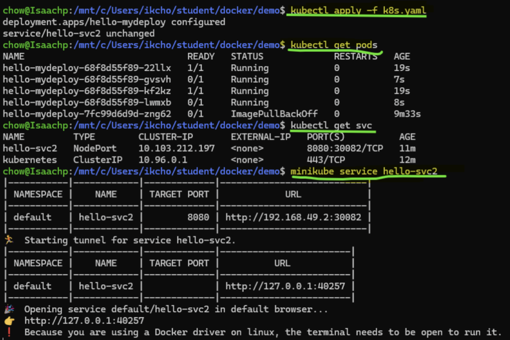

# CS7319_Homework4
_Kubernetes Hands-On – Minikube Deployment_ - Homework #4 for **CS 7319 Software Architecture & Design**  


# Homework Instructions
**Instructor:** Dr. Isaac Chow  
**Due Date:** September 21, 2025  
_*Assignment modified to support Python rather than Java. Original instructions here: [HW_4-Kubernetes-Hands-On.pdf](instructions/HW4-Kubernetes-Hands-On.pdf)._  

---

## Objective  
Implement a **REST API** that serves **five (5) inspirational quotes**—selected randomly on each request—from reputable sources (such as famous people). This app must be containerized with Docker and deployed on **Minikube** via a Kubernetes Deployment (4 replicas) exposed through a Service.  

---

## Functional Requirements  

1. **Endpoint:**  
   - `GET /api/quotes`  
   - Returns a JSON array of **exactly 4 quotes** chosen at random from a local pool of at least **10 quotes**.  

2. **Schema:**  
   - Each quote object includes:  
     - `text` → the quotation  
     - `author` → attribution  

3. **Port:**  
   - Application listens on **8080** (align with container/Kubernetes settings).  

4. **Homepage:**  
   - A minimal static page at `/` that fetches and displays **five quotes** from `/api/quotes`.  

---

## Containerization & Kubernetes  

1. **Dockerize** the API service and confirm it runs locally.  

2. **Deploy to Minikube** using a Deployment with **4 replicas** and a Service for access (NodePort is acceptable in Minikube).  

3. **Verification:**  
   - Show that you can access the endpoint on Minikube.  

---

## Deliverables  

1. **Screenshots** showing successful runs.  
2. **Source Code** and **Dockerfile**.  
3. **Kubernetes manifests** (`k8s.yaml`).  

---

## Useful Commands  

### Build & Push Image  
```bash
eval $(minikube docker-env)
docker build -t myhello:latest .
docker login
docker tag myhello:latest <your-dockerhub-username>/myhello:latest
docker push <your-dockerhub-username>/myhello:latest
```

### Deploy to Kubernetes  
```bash
kubectl apply -f k8s.yaml
kubectl get pods
kubectl get svc
minikube service cs7319-quotes-api
```

---

## Useful `kubectl` Commands  

- **Apply manifests (Deployment + Service):**  
  ```bash
  kubectl apply -f k8s.yaml
  ```

- **Check what’s running:**  
  ```bash
  kubectl get pods
  kubectl get deploy
  kubectl get svc
  ```

- **Review replication and rollout status:**  
  ```bash
  kubectl rollout status deployment/<deployment-name>
  ```

- **Scale replicas (e.g., from 4 to 6):**  
  ```bash
  kubectl scale deployment/<deployment-name> --replicas=6
  ```

- **Inspect resource details:**  
  ```bash
  kubectl describe pods
  kubectl describe svc
  ```

- **Access application endpoint (in Minikube):**  
  ```bash
  minikube service <service-name> --url
  ```


---

## Other Helpful Commands  

- List pods across all namespaces:  
  ```bash
  kubectl get pods --all-namespaces
  ```

- Get more detail:  
  ```bash
  kubectl get pods -o wide
  ```

- View logs:  
  ```bash
  kubectl logs <pod-name>
  ```

- Stop the app entirely (scale to zero):  
  ```bash
  kubectl scale deployment/<deployment-name> --replicas=0
  ```

---

## Notes (Quick Start)
Minimal, nominal path to run locally with Minikube:

1) Setup kubectl + minikube
- If kubectl isn’t installed, you can use the one bundled with minikube:
  ```bash
  alias kubectl="minikube kubectl --"
  ```
- Start a local cluster (Docker driver is simplest on WSL/Linux):
  ```bash
  minikube start --driver=docker
  ```

2) Build and load the Docker image
```bash
docker build -t cs7319-quotes-api:latest .
minikube image load cs7319-quotes-api:latest
```

3) Deploy manifests and wait for rollout
```bash
kubectl apply -f k8s.yaml
kubectl rollout status deploy/cs7319-quote-api-deployment
```

4) Access the app (pick one)
- Port-forward (simple and reliable):
  ```bash
  kubectl port-forward svc/cs7319-quote-api-service 8080:80
  # in another terminal
  curl http://localhost:8080/
  curl http://localhost:8080/api/quotes?count=4
  ```
- Or get a direct URL from Minikube:
  ```bash
  minikube service cs7319-quote-api-service --url
  ```

5) Optional
- Scale replicas (if not already set in k8s.yaml):
  ```bash
  kubectl scale deployment/cs7319-quote-api-deployment --replicas=4
  ```
- Reset cluster if needed:
  ```bash
  minikube delete && minikube start --driver=docker
  ```

_NOTE: GitLab CoPilot was used to assist in generating this README and converting the original PDF instructions to python._